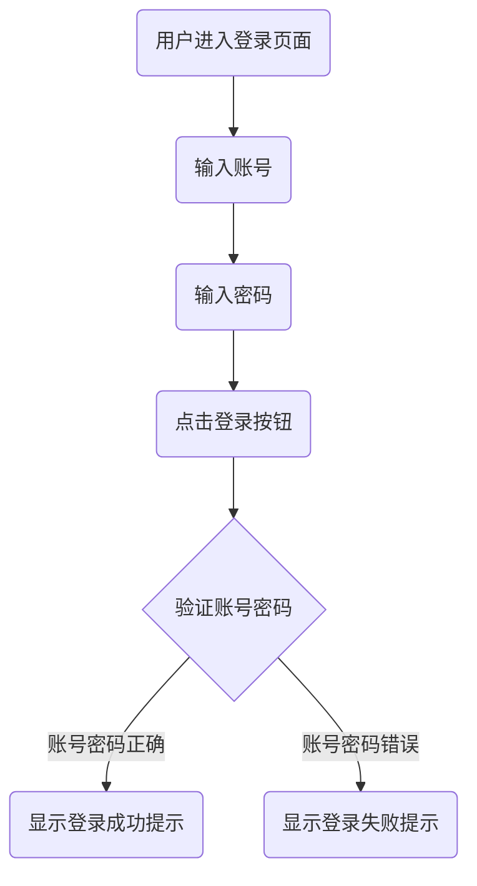

## 1. 产品概述
一个纯前端的登录页面应用，用于验证用户身份。内置账户为账号admin，密码123。
- 主要目的：提供简洁的登录验证功能
- 目标用户：需要登录系统的管理员

## 2. 核心功能

### 2.1 用户角色
| 角色 | 注册方式 | 核心权限 |
|------|----------|----------|
| 管理员 | 内置账户 | 登录系统 |

### 2.2 功能模块
1. **登录页面**：账号输入框、密码输入框、登录按钮、提示信息

### 2.3 页面详情
| 页面名称 | 模块名称 | 功能描述 |
|----------|----------|----------|
| 登录页面 | 表单区域 | 用户输入账号密码，点击登录进行验证 |
| 登录页面 | 提示区域 | 显示登录成功或失败的提示信息 |

## 3. 核心流程
用户进入登录页面 → 输入账号和密码 → 点击登录按钮 → 系统验证账号密码 → 显示登录结果

## 4. 用户界面设计

### 4.1 设计风格
- 主色调：深蓝色系，传达专业、安全的感觉
- 按钮风格：圆角矩形，悬停时有渐变效果
- 字体：使用现代无衬线字体
- 布局：居中卡片式布局
- 动画：表单输入聚焦动画、按钮点击反馈

### 4.2 页面设计概述
| 页面名称 | 模块名称 | UI元素 |
|----------|----------|--------|
| 登录页面 | 表单区域 | 输入框、密码框、登录按钮、提示信息 |
| 登录页面 | 背景区域 | 渐变背景、装饰元素 |

### 4.3 响应式设计
- 桌面端优先设计
- 移动端自适应布局，卡片宽度随屏幕调整

### 4.4 交互细节
- 输入框聚焦时显示边框高亮
- 密码框支持显示/隐藏功能
- 登录按钮点击后有加载状态
- 提示信息有淡入动画效果
